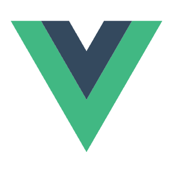
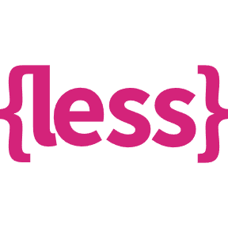

### Welcome, visitor. Wishing you a wonderful day✨

##### 目前状态

> 离职后，开始研究一些程序员创业技能，目前处于低成本自由创业中。小项目+远程办公。发现没赚到几个蹦子，压力更大了，酸Q~😂

##### 个人介绍

> 专注web前端开发，对各类小程序、跨端开发也有一定了解和开发经验。深知时间就是金钱，效率就是生命，所以对于前端工程化等可以持续提高研发效率和质量的事情也感兴趣。在系列项目开发中，也基于`nodejs`做过一些小的自动化工具，集成到项目工具链中，来帮助项目的一些特殊又繁琐的需求自动化实现。
>
> 今年把更多时间放在了`nodejs`技术栈的web 后台开发，对全栈开发也有了一些更进一步的涉猎，到目前为止做过几个小的全栈项目，项目前端核心技术栈主要是`react`+`typescript`，后台主要是搭建`RESTful`风格的`web api`服务，为多端前端项目提供统一的接口服务，核心技术栈主要是`egg.js`+系列插件(包括基础业务需求、性能、安全和缓存等) + `mongoose` 。数据库以`MongoDB`为主。

**Languages:**  

<code></code>
<code></code>
<code></code>
<code></code>
<code></code>
<code></code>
<code></code>
<code></code>
<code></code>

